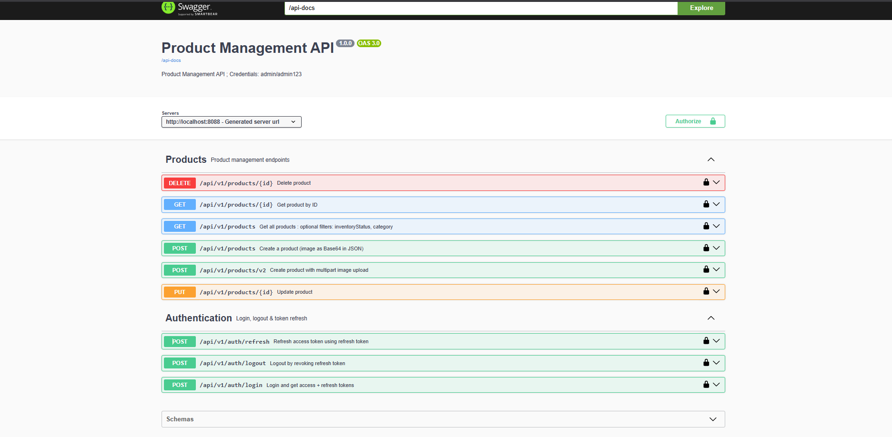
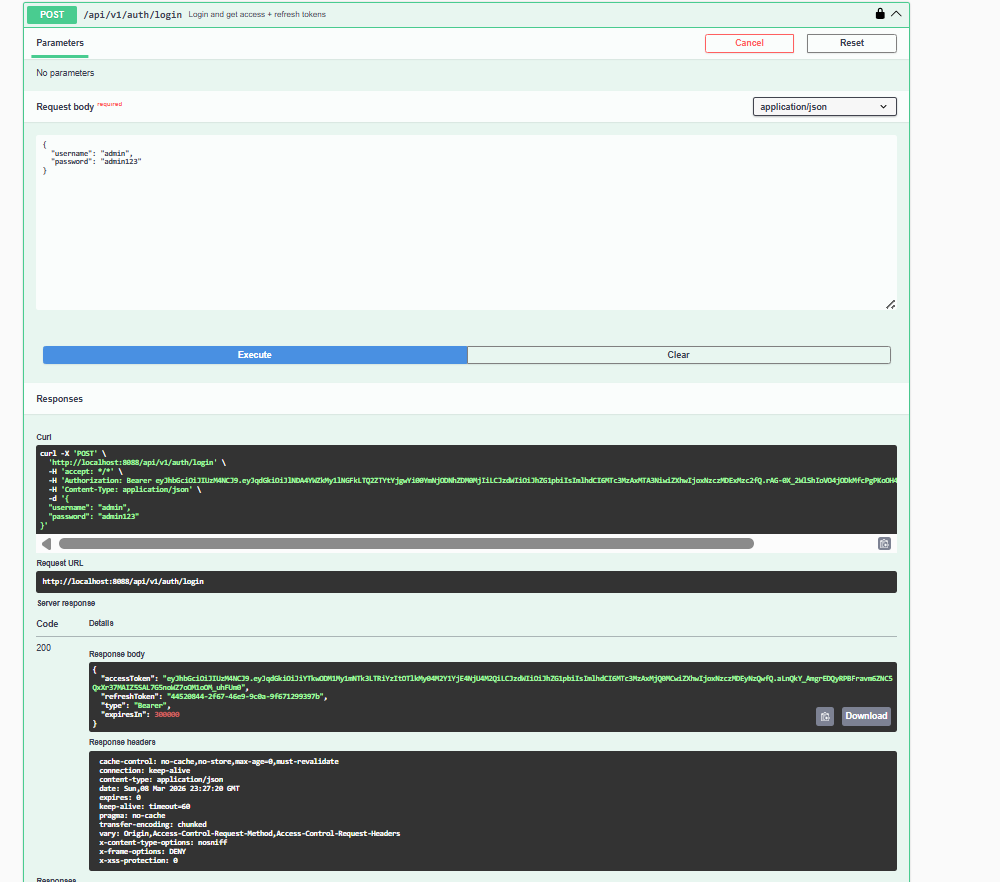
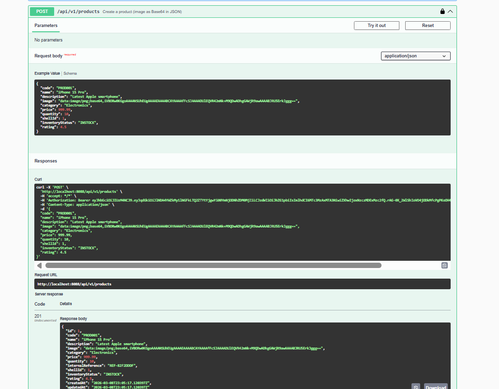

# Product Management API

A RESTful API for product management built with **Spring Boot 3**, secured with **JWT authentication** (access + refresh tokens), and documented with **Swagger/OpenAPI**.

---

## Table of Contents

- [Tech Stack](#tech-stack)
- [Architecture](#architecture)
- [Getting Started](#getting-started)
- [API Documentation (Swagger)](#api-documentation-swagger)
- [Authentication](#authentication)
- [API Endpoints](#api-endpoints)
- [Running Tests](#running-tests)
- [Email Notifications](#email-notifications)
- [Environment Variables](#environment-variables)

---

## Tech Stack

| Layer          | Technology                          |
|----------------|-------------------------------------|
| Language       | Java 17                             |
| Framework      | Spring Boot 3.2.3                   |
| Security       | Spring Security + JWT (jjwt 0.12.5) |
| Database       | PostgreSQL 16                       |
| ORM            | Spring Data JPA / Hibernate         |
| Testing        | JUnit 5, Mockito, H2 (in-memory)   |
| Documentation  | springdoc-openapi (Swagger UI)      |
| Email          | Spring Mail (SMTP)                  |
| Containerization | Docker, Docker Compose            |

---

## Architecture

```
├── controller/        # REST controllers
├── service/           # Business logic 
├── repository/        # Spring Data JPA repositories
├── entity/            # JPA entities 
├── dto/               # Request/Response DTOs 
├── mapper/            # Entity <-> DTO mapping 
├── security/          # JWT filter, JWT service, UserDetails config
├── config/            # Security, OpenAPI, JPA Auditing, ModelMapper, Email
├── event/             # Domain events 
├── exception/         # Global exception handler, custom exceptions
```

---

## Getting Started

### Prerequisites

- Java 17+
- Maven 3.8+
- PostgreSQL 16 (or Docker)

### Option A — Docker (recommended)

```bash
docker compose up -d
```

This starts:
- **PostgreSQL** on port `5432` (db: `productdb`, user: `postgres`, password: `postgres123`)
- **pgAdmin** on port `5050` (email: `admin@admin.com`, password: `admin123`)

Then run the app:

```bash
mvn spring-boot:run
```

### Option B — Local PostgreSQL

1. Create the database:

```sql
CREATE DATABASE productdb;
```

2. Run the application:

```bash
mvn spring-boot:run
```

The app starts on **port 8088** by default.

---

## API Documentation (Swagger)

Once the application is running, access the interactive API documentation:

| Resource       | URL                                                        |
|----------------|------------------------------------------------------------|
| **Swagger UI** | [http://localhost:8088/swagger-ui/index.html](http://localhost:8088/swagger-ui/index.html) |
| **OpenAPI JSON** | [http://localhost:8088/api-docs](http://localhost:8088/api-docs) |

### Swagger UI Preview

#### All Endpoints Overview


#### Auth Endpoints – Login Example


#### Product Endpoints – Create Product (Base64 Image)

#### Product Endpoints – Create Product (Multipart Image Upload)


---

## Authentication

The API uses **stateless JWT** authentication with a **short-lived access token + refresh token** pattern.

### Login

```http
POST /api/v1/auth/login
Content-Type: application/json

{
  "username": "admin",
  "password": "admin123"
}
```

**Response:**

```json
{
  "accessToken": "<jwt>",
  "refreshToken": "<uuid>",
  "type": "Bearer",
  "expiresIn": 300000
}
```

### Using the token

Add the access token to all protected requests:

```
Authorization: Bearer <accessToken>
```

### Refresh token

When the access token expires, use the refresh token to get a new pair:

```http
POST /api/v1/auth/refresh
Content-Type: application/json

{
  "refreshToken": "<uuid>"
}
```

### Logout

Invalidates the refresh token:

```http
POST /api/v1/auth/logout
Content-Type: application/json

{
  "refreshToken": "<uuid>"
}
```

### Public endpoints (no auth required)

- `POST /api/v1/auth/login`
- `POST /api/v1/auth/refresh`
- `GET /swagger-ui/**`
- `GET /api-docs/**`

---

## API Endpoints

### Products — `/api/v1/products`

All product endpoints require a valid `Authorization: Bearer <token>` header.

| Method   | Endpoint                | Description                        |
|----------|-------------------------|------------------------------------|
| `POST`   | `/api/v1/products`      | Create a product (JSON body)       |
| `POST`   | `/api/v1/products/v2`   | Create a product with image upload |
| `GET`    | `/api/v1/products`      | List all products (with filters)   |
| `GET`    | `/api/v1/products/{id}` | Get a product by ID                |
| `PUT`    | `/api/v1/products/{id}` | Update a product                   |
| `DELETE` | `/api/v1/products/{id}` | Delete a product                   |

**Query filters** on `GET /api/v1/products`:

| Parameter         | Type   | Description                              |
|-------------------|--------|------------------------------------------|
| `inventoryStatus` | string | Filter by status: `INSTOCK`, `LOWSTOCK`, `OUTOFSTOCK` |
| `category`        | string | Filter by category name                  |

**Product request body:**

```json
{
  "code": "PROD001",
  "name": "iPhone 15 Pro",
  "description": "Latest Apple smartphone",
  "image": "data:image/png;base64,...",
  "category": "Electronics",
  "price": 999.99,
  "quantity": 10,
  "shellId": 1,
  "inventoryStatus": "INSTOCK",
  "rating": 4.5
}
```

**Product response:**

```json
{
  "id": 1,
  "code": "PROD001",
  "name": "iPhone 15 Pro",
  "description": "Latest Apple smartphone",
  "image": "data:image/png;base64,...",
  "category": "Electronics",
  "price": 999.99,
  "quantity": 10,
  "internalReference": "REF-A1B2C3D4",
  "shellId": 1,
  "inventoryStatus": "INSTOCK",
  "rating": 4.5,
  "createdAt": "2026-03-08T21:30:00Z",
  "updatedAt": "2026-03-08T21:30:00Z"
}
```

### Auth — `/api/v1/auth`

| Method | Endpoint              | Description                  | Auth required |
|--------|-----------------------|------------------------------|---------------|
| `POST` | `/api/v1/auth/login`  | Login and get token pair     | No            |
| `POST` | `/api/v1/auth/refresh`| Refresh access token         | No            |
| `POST` | `/api/v1/auth/logout` | Invalidate refresh token     | No            |

---

## Running Tests

The project includes **47 tests** covering unit and integration layers:

| Test class                   | Type        | Count | Description                          |
|------------------------------|-------------|-------|--------------------------------------|
| `ProductControllerTest`      | Unit        | 10    | Controller layer with `@WebMvcTest`  |
| `ProductServiceImplTest`     | Unit        | 12    | Service layer with Mockito           |
| `ProductRepositoryTest`      | Unit        | 9     | Repository layer with `@DataJpaTest` |
| `ProductIntegrationTest`     | Integration | 10    | Full stack product CRUD              |
| `AuthIntegrationTest`        | Integration | 6     | Auth flow (login, refresh, logout)   |

```bash
# Run all tests
mvn clean test

# Run only unit tests
mvn test -Dtest="*Unit*,*Controller*,*Service*,*Repository*"

# Run only integration tests
mvn test -Dtest="*Integration*"
```

Tests use **H2 in-memory database** and a separate `application-test.properties` profile.

---

## Email Notifications

The API sends **asynchronous email notifications** when products are created or deleted, using a **Spring event-driven architecture**.
**Flow:**

```
Controller -> Service -> DB commit -> Event fired -> [Async] Listener -> EmailService -> SMTP
```


---

## Environment Variables

All variables have defaults for local development. Override them for production:

| Variable                 | Default                            | Description                |
|--------------------------|------------------------------------|----------------------------|
| `SPRING_DATASOURCE_URL`  | `jdbc:postgresql://localhost:5432/productdb` | JDBC connection URL |
| `SPRING_DATASOURCE_USERNAME` | `postgres`                     | Database username          |
| `SPRING_DATASOURCE_PASSWORD` | `postgres123`                  | Database password          |
| `JWT_SECRET`             | *(dev key)*                        | Base64-encoded HMAC key    |
| `JWT_EXPIRATION`         | `300000` (5 min)                   | Access token TTL (ms)      |
| `JWT_REFRESH_EXPIRATION` | `604800000` (7 days)               | Refresh token TTL (ms)     | 
